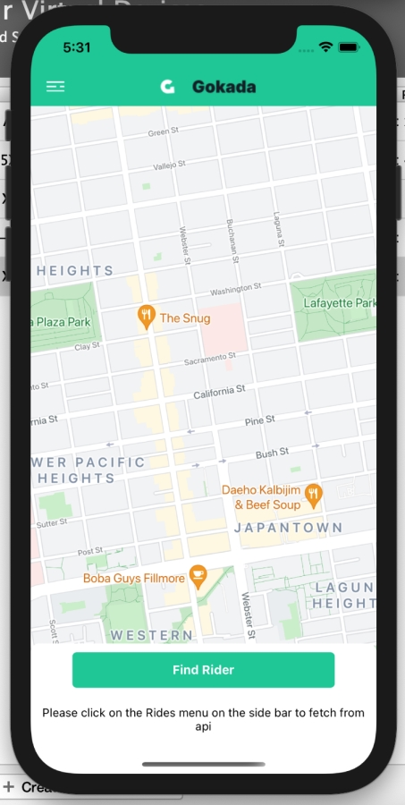
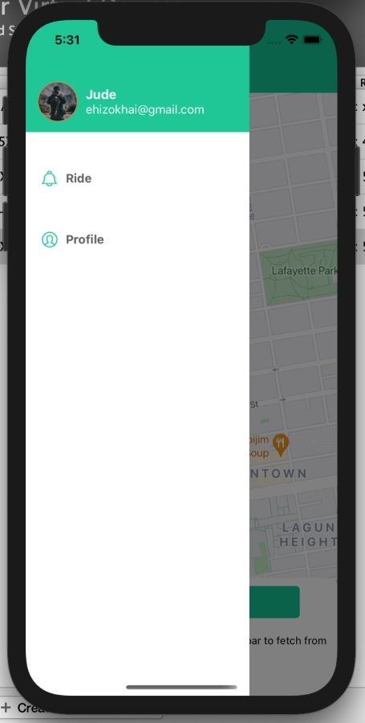
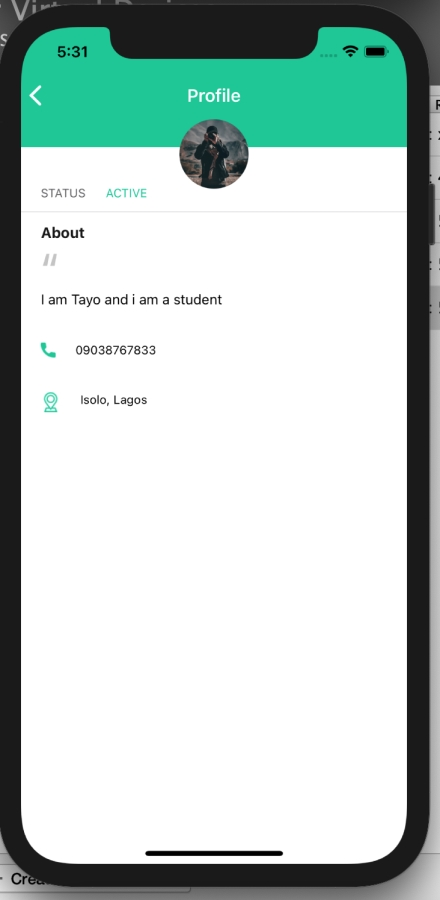
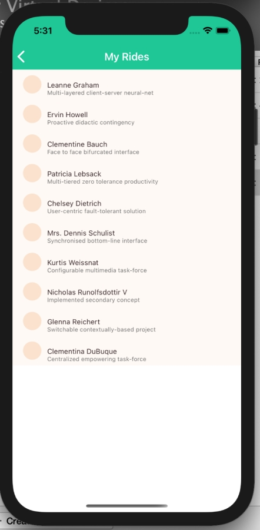
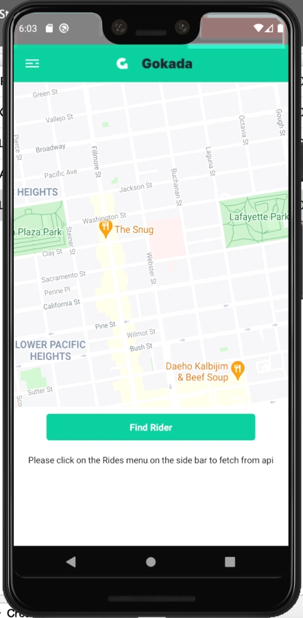
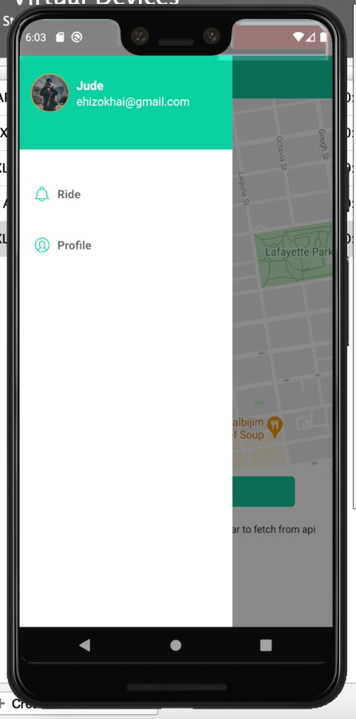
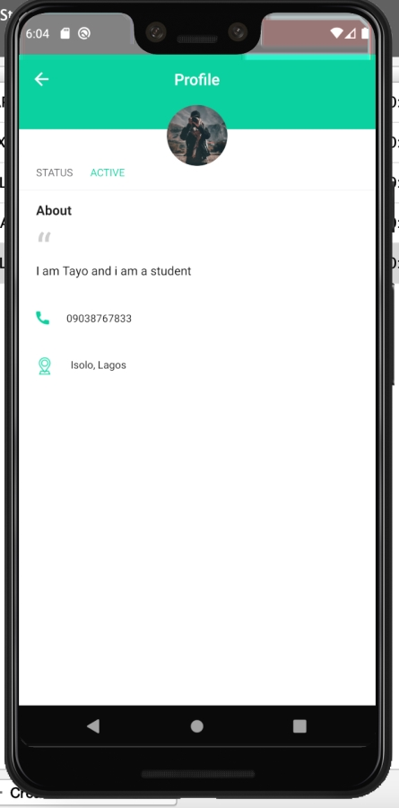
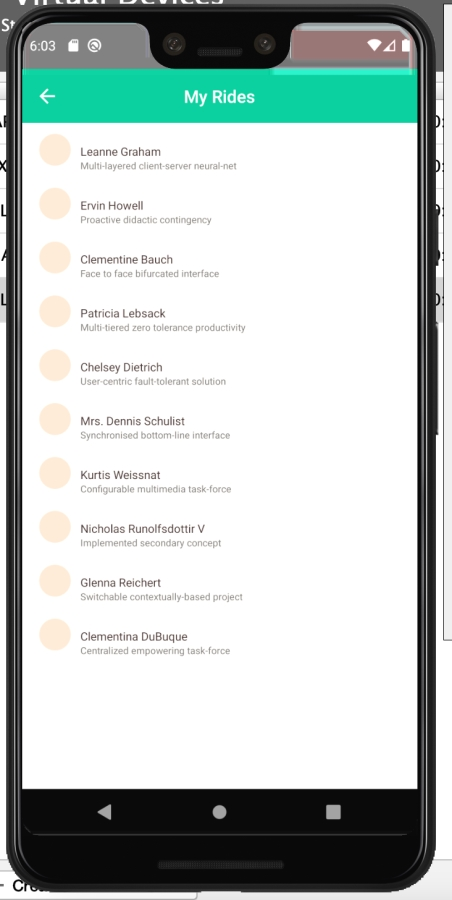
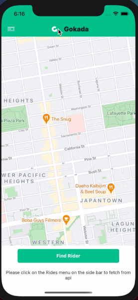

# Introduction

This is the repository for `Gokada Home Module`.

---

## Usage Instructions
### Installation 
1. Run `npm install`.
2. `cd ios`.
3. Run `pod install`

## Check API page
1. Click on the side menu
2. Click on rides

## IOS App
Home page ios        |  Sidebar ios                |  Profile Page ios | Rides Page
:-------------------------:|:-------------------------:|:-------------------------: |:-------------------------:
  |   |   | 

## Android App
Home page android        |  Sidebar android                |  Profile Page android | Rides Page android
:-------------------------:|:-------------------------:|:-------------------------: |:-------------------------:
  |   |   | 

## Usage App
